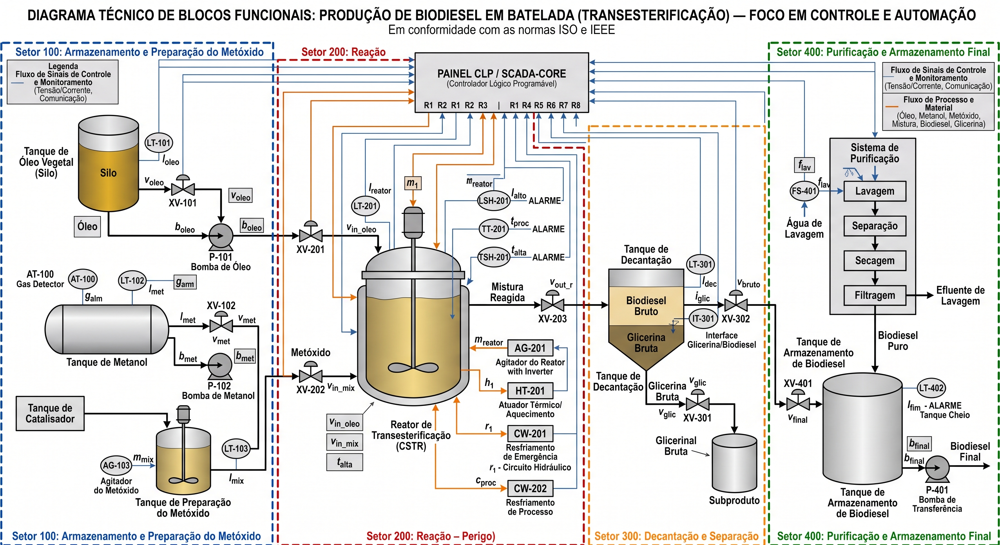

# Industria escolhida: Produção de Biodiesel (Transesterificação)

## 🌐 Simulador SCADA em Operação (GitHub Pages)

Acesse o sistema supervisório e motor de inferência em tempo real diretamente pelo navegador:

👉 **[SCADA-Core Automática — Planta de Biodiesel (Grupo 5)](https://igorfantucci.github.io/Aula-Automatica---GRUPO-5/)**

O simulador web permite:
* Testar os **5 cenários de estresse operacional** da Aula 10 com 1 clique;
* Manipular as variáveis analógicas ($PT-201, TT-201, LT-201, AT-100$) e digitais com cálculo dinâmico de histerese;
* Avaliar em tempo real os **Permissivos e Trips Fail-Safe** da Matriz SIS/SIL 3;
* Acompanhar a cadeia de inferência por **Forward Chaining** (Cláusulas de Horn R-01 a R-08);
* Conduzir **Auditorias Forenses por Backward Chaining** com árvore de explicabilidade dedutiva (*Explainable AI*).

---

## Insumos: Matérias-Primas e Reagentes Químicos

* **Fontes de Lipídios (Base da Reação):**
  * **Óleo Vegetal (Triglicerídeos):** Matéria-prima primária (soja, girassol, etc.) processada para virar biocombustível.
  * **Óleos Residuais ou Gordura Animal:** Fontes secundárias alternativas de lipídios que também podem ser processadas pela planta.

* **Fontes de Álcool (Reagente):**
  * **Metanol ($\text{CH}_3\text{OH}$):** Reagente principal que reage com os triglicerídeos para separar as cadeias de ésteres (biodiesel) da glicerina.

* **Catalisadores e Químicos Auxiliares:**
  * **Hidróxido de Sódio ($\text{NaOH}$) ou Potássio ($\text{KOH}$):** Catalisador alcalino misturado ao metanol no primeiro setor para formar a solução de metóxido.
  * **Água Industrial ($\text{H}_2\text{O}$):** Utilizada na etapa final de purificação (lavagem) para remover restos de catalisador, sabões e impurezas do biodiesel bruto.
  * **Ácido de Neutralização (Ácido Cítrico ou Clorídrico - $\text{HCl}$):** Utilizado em pequenas dosagens na etapa de lavagem para estabilizar o pH do produto final.

---

## Estrutura do Repositório — Etapa 01: Lógica Formal e Sistemas Especialistas

A pasta [`etapa-01-logica`](./etapa-01-logica/) contém toda a modelagem formal, provas matemáticas de segurança e códigos executáveis em Python/Jupyter para a automação e intertravamento da planta de biodiesel:

| Módulo | Documento Teórico (.md) | Caderno Executável (.ipynb) | Conteúdo e Foco de Engenharia |
| :---: | :--- | :---: | :--- |
| **00** | [00 - Materias Primas e Componentes.md](./etapa-01-logica/00%20-%20Materias%20Primas%20e%20Componentes.md) | — | Descrição dos insumos, produtos, subprodutos e equipamentos por setor (100 a 400). |
| **02** | [02 - Mapeamento de variáveis de processo.md](./etapa-01-logica/02%20-%20Mapeamento%20de%20vari%C3%A1veis%20de%20processo.md) | — | Mapeamento formal de instrumentos e sensores para proposições booleanas (ISA-5.1). |
| **03** | [03 - Tautologias e Contradicoes.md](./etapa-01-logica/03%20-%20Tautologias%20e%20Contradicoes.md) | [03 - Tautologias e Contradicoes.ipynb](./etapa-01-logica/03%20-%20Tautologias%20e%20Contradicoes.ipynb) | Provas dedutivas de tautologias de segurança e contradições de risco operacional. |
| **04** | [04 - Logica Proposicional Conectivos e Permissivos.md](./etapa-01-logica/04%20-%20Logica%20Proposicional%20Conectivos%20e%20Permissivos.md) | [04 - Logica Proposicional Conectivos e Permissivos.ipynb](./etapa-01-logica/04%20-%20Logica%20Proposicional%20Conectivos%20e%20Permissivos.ipynb) | Conectivos lógicos, permissivos de partida (*Start Permissives*) e blocos de intertravamento. |
| **05** | [05 - Formas Normais e Otimizacao Booleana.md](./etapa-01-logica/05%20-%20Formas%20Normais%20e%20Otimizacao%20Booleana.md) | [05 - Formas Normais e Otimizacao Booleana.ipynb](./etapa-01-logica/05%20-%20Formas%20Normais%20e%20Otimizacao%20Booleana.ipynb) | Minimização por álgebra de Boole, formas canônicas FND (SOP) e FNC (POS). |
| **06** | [06 - Quantificadores e Predicados em Redes de Sensores.md](./etapa-01-logica/06%20-%20Quantificadores%20e%20Predicados%20em%20Redes%20de%20Sensores.md) | [06 - Quantificadores e Predicados em Redes de Sensores.ipynb](./etapa-01-logica/06%20-%20Quantificadores%20e%20Predicados%20em%20Redes%20de%20Sensores.ipynb) | Lógica de predicados de 1ª ordem, quantificadores $\forall$ (FORALL) e $\exists$ (EXISTS) em redes de sensores. |
| **07** | [07 - Validade e Inferencia Logica na Seguranca de Processos.md](./etapa-01-logica/07%20-%20Validade%20e%20Inferencia%20Logica%20na%20Seguranca%20de%20Processos.md) | [07 - Validade e Inferencia Logica na Seguranca de Processos.ipynb](./etapa-01-logica/07%20-%20Validade%20e%20Inferencia%20Logica%20na%20Seguranca%20de%20Processos.ipynb) | Regras canônicas de inferência (MP, MT, SH, SD, RES, DC), falácias e prova formal de matriz ESD. |
| **08** | [08 - Base de Conhecimento e Regras de Diagnostico.md](./etapa-01-logica/08%20-%20Base%20de%20Conhecimento%20e%20Regras%20de%20Diagnostico.md) | [08 - Base de Conhecimento e Regras de Diagnostico.ipynb](./etapa-01-logica/08%20-%20Base%20de%20Conhecimento%20e%20Regras%20de%20Diagnostico.ipynb) | Sistemas especialistas (RBS), Cláusulas de Horn, priorização SIL e procedimentos POP. |
| **09** | [09 - Motor de Inferencia Forward e Backward Chaining.md](./etapa-01-logica/09%20-%20Motor%20de%20Inferencia%20Forward%20e%20Backward%20Chaining.md) | [09 - Motor de Inferencia Forward e Backward Chaining.ipynb](./etapa-01-logica/09%20-%20Motor%20de%20Inferencia%20Forward%20e%20Backward%20Chaining.ipynb) | Motores de encadeamento progressivo (*Forward*) e regressivo (*Backward*) com explicabilidade (XAI). |
| **10** | [10 - Avaliacao Modulo 1 Motor de Intertravamento e Diagnostico.md](./etapa-01-logica/10%20-%20Avaliacao%20Modulo%201%20Motor%20de%20Intertravamento%20e%20Diagnostico.md) | [10 - Avaliacao Modulo 1 Motor de Intertravamento e Diagnostico.ipynb](./etapa-01-logica/10%20-%20Avaliacao%20Modulo%201%20Motor%20de%20Intertravamento%20e%20Diagnostico.ipynb) | SCADA-Core integrado: telemetria, permissivos failsafe, matriz ESD e bateria de estresse de 5 cenários. |

---

## Diagrama Funcional da Planta de Biodiesel

---

## 📽️ Apresentação Executiva em LaTeX (Beamer)

Para a defesa do **Motor de Intertravamento e Diagnóstico**, foi elaborada uma apresentação completa em LaTeX Beamer estruturada para apresentação compartilhada por 4 integrantes:

* **Código-fonte em LaTeX:** [`apresentacao_etapa_01.tex`](./apresentacao_etapa_01.tex)
* **Slides Compilados em PDF:** [`apresentacao_etapa_01.pdf`](./apresentacao_etapa_01.pdf)

### Estrutura das Falas (4 Apresentadores):
1. **Apresentador 1 — Fundamentos \& Modelagem ISA-5.1:** Contexto da Planta de Biodiesel, Reação Química, Topologia dos 4 Setores Industriais, Instrumentação ISA-5.1 e Discretização Matemática de Sinais com Banda Morta ($\delta$).
2. **Apresentador 2 — Lógica Proposicional \& Otimização Booleana:** Permissivos de Partida (*Start Permissives*), Desarmes *Fail-Safe*, Prova de Tautologias de Segurança, Formas Normais (FND/FNC) e Minimização de Scan no CLP.
3. **Apresentador 3 — Redes de Sensores \& Prova SIS:** Predicados e Quantificadores ($\forall, \exists$), Regras Canônicas de Inferência (MP, MT, Silogismos), Rejeição Formal de Falácias Industriais e Prova por SAT Solver da Matriz ESD ($2^{11}$ estados).
4. **Apresentador 4 — Sistemas Especialistas \& SCADA Integrado:** Arquitetura do RBS, Catálogo de 8 Cláusulas de Horn (R-01 a R-08), Motores *Forward* e *Backward Chaining* (XAI), Bateria de 5 Cenários de Estresse e Demonstração do Simulador SCADA em Tempo Real.

