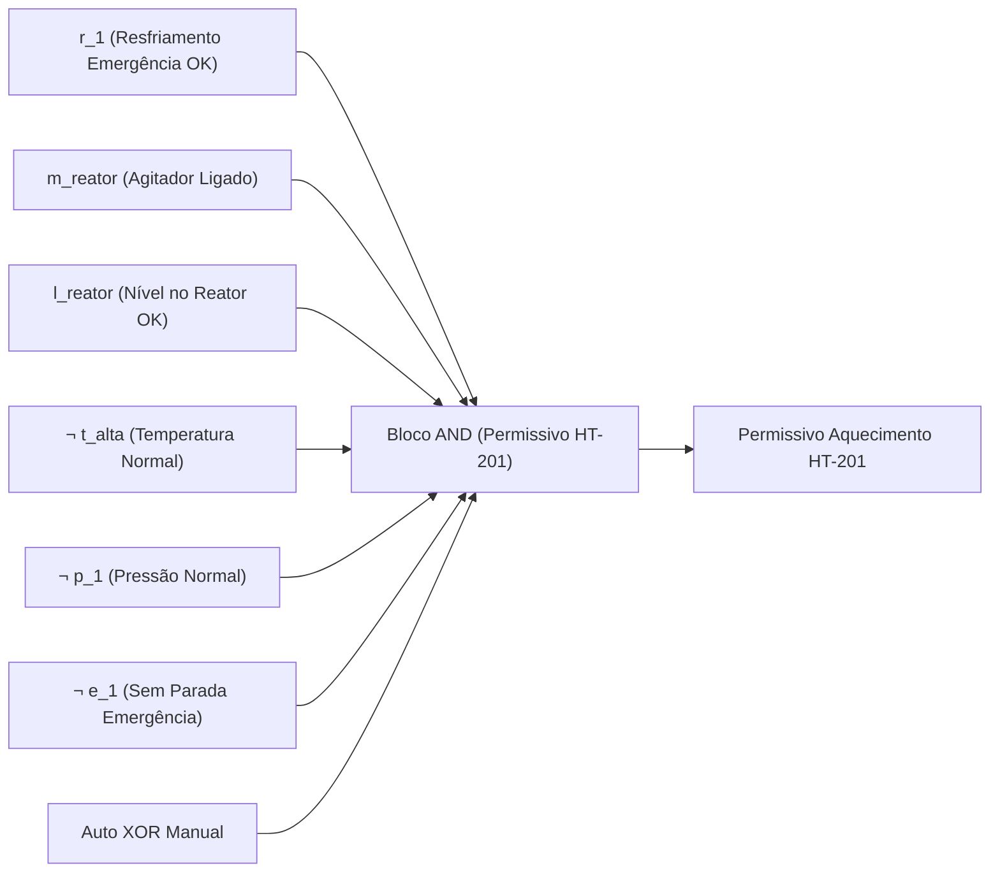

# Aula 04: Lógica Proposicional — Conectivos e Blocos de Permissivos

## 1. Fundamentos Matemáticos: Conectivos Lógicos

Na matemática discreta e na lógica formal, uma **proposição** é uma sentença declarativa à qual se atribui um e apenas um valor-verdade: **Verdadeiro** ($1$) ou **Falso** ($0$).

No contexto de sistemas de controle, automação de processos e segurança funcional (normas IEC 61131-3 e IEC 61508 / IEC 61511), os estados de sensores discretos, transmissores com thresholds e atuadores são mapeados diretamente em variáveis proposicionais booleanas.

As operações fundamentais sobre essas variáveis são formalizadas pelos seguintes conectivos lógicos:

1. **Negação ($\neg A$ ou $\bar{A}$):** Inverte o valor-verdade da proposição de entrada. Utilizada para tratar sinais de contato normalmente fechado (NF), alarmes ativos em nível lógico baixo ou condições de ausência de falha ($
eg e_1$, $
eg p_1$, $
eg g_{alm}$).
2. **Conjunção ($A \land B$):** Resulta em verdadeiro se e somente se ambos os operandos forem simultaneamente verdadeiros. Na engenharia de automação, modela circuitos e condições em **série**, tais como cadeias de permissivos de partida (*Start Permissives*) e requisitos simultâneos de segurança.
3. **Disjunção ($A \lor B$):** Resulta em verdadeiro se ao menos um dos operandos for verdadeiro. Modela circuitos e condições em **paralelo**, caminhos redundantes de segurança ou múltiplas causas independentes de desarme (*Trip/Interlock*).
4. **Disjunção Exclusiva ($A \oplus B$):** Resulta em verdadeiro se e somente se exatamente um dos operandos for verdadeiro (equivalente a $
eg(A \leftrightarrow B)$). É rigorosamente empregada em seletores de modo operacional mutuamente exclusivos (ex.: $\text{Auto} \oplus \text{Manual}$).
5. **Implicação / Condicional ($A \rightarrow B \equiv \neg A \lor B$):** Estabelece uma relação de causa e efeito ou regra de garantia operacional: "SE a condição/comando $A$ está ativa, ENTÃO o estado/restrição $B$ deve ser satisfeito".
6. **Bicondicional ($A \leftrightarrow B \equiv (A \rightarrow B) \land (B \rightarrow A)$):** Modela a estrita equivalência lógica e sincronismo entre dois estados operacionais.

---

## 2. Aplicação em Engenharia: Permissivos e Intertravamentos na Planta de Biodiesel

Em plantas químicas de batelada, um **permissivo de partida** (*Start Permissive*) define as condições booleanas necessárias para autorizar a transição de estado de um atuador (energização de bomba, acionamento de aquecedor, abertura de válvula de insumo tóxico/inflamável). A **intertrava de bloqueio contínuo** (*Run Interlock / Trip*) monitora o processo continuamente após o acionamento e, caso violada, comanda o equipamento imediatamente para o seu estado seguro (*fail-safe*).

Abaixo são formalizados os blocos lógicos para os equipamentos críticos da planta de produção de biodiesel por transesterificação.

---

### 2.1. Permissivo e Trip do Sistema de Aquecimento do Reator ($P_{\text{HT-201}}$)

O sistema de aquecimento do reator $\text{HT-201}$ eleva a mistura reacional (óleo vegetal + metóxido) até a temperatura ideal de reação ($\sim 60^\circ\text{C}$). Para evitar sobreaquecimento, evaporação de metanol ou choque térmico sem salvaguarda, o acionamento depende de:
- Sistema de resfriamento de emergência pressurizado e disponível: $r_1$ (Regra R1)
- Agitador do reator em operação (homogeneização térmica): $m_{reator}$
- Nível de líquido cobrindo o sensor mínimo de processo (sem aquecimento a seco): $l_{reator}$
- Ausência de alarme de temperatura crítica: $\neg t_{alta}$
- Ausência de alarme de sobrepressão no vaso: $\neg p_1$
- Ausência de parada de emergência: $\neg e_1$
- Modo operacional válido: $\text{Auto} \oplus \text{Manual}$

#### Equação Proposicional do Permissivo:
$$P_{\text{HT-201}} \equiv r_1 \land m_{reator} \land l_{reator} \land \neg t_{alta} \land \neg p_1 \land \neg e_1 \land (\text{Auto} \oplus \text{Manual})$$

#### Equação do Trip (Desarme Imediato):
$$\text{Trip}_{\text{HT-201}} \equiv \neg r_1 \lor \neg m_{reator} \lor \neg l_{reator} \lor t_{alta} \lor p_1 \lor e_1$$

Pelas **Leis de De Morgan**:
$$\text{Trip}_{\text{HT-201}} \equiv \neg \big( r_1 \land m_{reator} \land l_{reator} \land \neg t_{alta} \land \neg p_1 \land \neg e_1 \big)$$

---

### 2.2. Permissivo da Válvula de Adição de Metóxido ($P_{\text{XV-202}}$)

A dosagem do metóxido (mistura corrosiva e inflamável de metanol com catalisador alcalino) no reator $\text{R-200}$ exige:
- Agitador do reator ligado (evita zonas de alta concentração de catalisador): $m_{reator}$
- Nível de óleo vegetal transferido para o reator: $l_{reator}$
- Sem sobrepressão no reator: $\neg p_1$
- Sem temperatura excessiva: $\neg t_{alta}$
- Sem transbordamento / nível máximo atingido: $\neg l_{alto}$
- Ausência de vapores inflamáveis na área: $\neg g_{alm}$
- Sem emergência ativa: $\neg e_1$
- Modo operacional definido: $\text{Auto} \oplus \text{Manual}$

#### Equação Proposicional:
$$P_{\text{XV-202}} \equiv m_{reator} \land l_{reator} \land \neg p_1 \land \neg t_{alta} \land \neg l_{alto} \land \neg g_{alm} \land \neg e_1 \land (\text{Auto} \oplus \text{Manual})$$

#### Equação do Trip de Fechamento (*Fail-Close*):
$$\text{Trip}_{\text{XV-202}} \equiv \neg m_{reator} \lor \neg l_{reator} \lor p_1 \lor t_{alta} \lor l_{alto} \lor g_{alm} \lor e_1$$

---

### 2.3. Permissivo do Agitador de Preparação de Metóxido ($P_{\text{AG-103}}$)

O misturador $\text{AG-103}$ no tanque de metóxido homogeneíza o álcool e o hidróxido:
- Nível de líquido presente no tanque: $l_{mix}$
- Ausência de vazamento de vapores inflamáveis: $\neg g_{alm}$ (Regra R7)
- Sem botão de emergência ativo: $\neg e_1$
- Modo operacional exclusivo: $\text{Auto} \oplus \text{Manual}$

#### Equação Proposicional:
$$P_{\text{AG-103}} \equiv l_{mix} \land \neg g_{alm} \land \neg e_1 \land (\text{Auto} \oplus \text{Manual})$$

$$\text{Trip}_{\text{AG-103}} \equiv \neg l_{mix} \lor g_{alm} \lor e_1$$

---

### 2.4. Permissivo da Válvula de Dreno de Glicerina ($P_{\text{XV-301}}$)

No tanque de decantação $\text{TK-300}$, a separação de fases ocorre por diferença de densidade. O dreno de glicerina para o fundo só pode ser iniciado se:
- Decantador cheio e em repouso completado: $l_{dec}$
- Interface biodiesel/glicerina detectada pelo sensor $\text{IT-301}$: $i_{glic}$ (Regra R6)
- Sem parada de emergência: $\neg e_1$
- Modo de operação válido: $\text{Auto} \oplus \text{Manual}$

#### Equação Proposicional:
$$P_{\text{XV-301}} \equiv l_{dec} \land i_{glic} \land \neg e_1 \land (\text{Auto} \oplus \text{Manual})$$

$$\text{Trip}_{\text{XV-301}} \equiv \neg l_{dec} \lor \neg i_{glic} \lor e_1$$

---

### 2.5. Permissivo da Bomba de Transferência Final de Biodiesel ($P_{\text{P-401}}$)

A bomba $\text{P-401}$ envia o biodiesel seco e purificado para o tanque de expedição:
- Fluxo de purificação/lavagem validado: $f_{lav}$ (Regra R8)
- Válvula de alinhamento do tanque de armazenamento aberta: $v_{final}$
- Tanque final com capacidade disponível (não cheio): $\neg l_{fim}$
- Sem emergência ativa: $\neg e_1$
- Modo de operação válido: $\text{Auto} \oplus \text{Manual}$

#### Equação Proposicional:
$$P_{\text{P-401}} \equiv f_{lav} \land v_{final} \land \neg l_{fim} \land \neg e_1 \land (\text{Auto} \oplus \text{Manual})$$

$$\text{Trip}_{\text{P-401}} \equiv \neg f_{lav} \lor \neg v_{final} \lor l_{fim} \lor e_1$$

---

## 3. Entregável da Aula 04

* **Algoritmo de Intertravamento e Permissivos da Planta de Biodiesel:** Implementação modular em Python dos operadores fundamentais, das funções de permissivos e trips para os atuadores críticos ($\text{HT-201}$, $\text{XV-202}$, $\text{AG-103}$, $\text{XV-301}$ e $\text{P-401}$), validação através de cenários de contingência e geração exaustiva de tabelas-verdade.

---

### Referências Consultadas
1. INTERNATIONAL ELECTROTECHNICAL COMMISSION. **IEC 61131-3: Programmable controllers - Part 3: Programming languages**. Geneva: IEC, 2013.
2. INTERNATIONAL ELECTROTECHNICAL COMMISSION. **IEC 61511: Functional safety - Safety instrumented systems for the process industry sector**. Geneva: IEC, 2016.
3. INTERNATIONAL SOCIETY OF AUTOMATION. **ANSI/ISA-5.1-2009: Instrumentation Symbols and Identification**. Research Triangle Park: ISA, 2009.
4. ROSEN, Kenneth H. **Discrete Mathematics and Its Applications**. 8th ed. New York: McGraw-Hill, 2019.
5. GERPEN, Jon Van et al. **Biodiesel Production Technology**. National Renewable Energy Laboratory (NREL), Subcontractor Report NREL/SR-510-36244, 2004.

