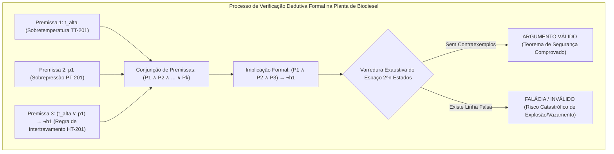

# Aula 07: Validade e Inferência Lógica na Segurança de Processos
**Projeto:** Automação e Segurança Funcional da Planta de Biodiesel (Transesterificação em Batelada)  
**Módulo:** Validade de Argumentos Dedutivos, Inferência Lógica e Prova de Consistência da Matriz de Segurança (ESD / SIS)

---

## 1. Fundamentos Matemáticos: Argumentos Dedutivos, Validade e Tautologias

Na engenharia de automação e segurança funcional de processos químicos contínuos e em batelada (*Safety Instrumented Systems - SIS*, normas **IEC 61511** e **IEC 61508**), as matrizes de intertravamento de segurança (*Interlocks*) e os sistemas de desligamento de emergência (*Emergency Shutdown - ESD*) exigem garantias matemáticas formais de que nunca ocorrerão falhas de segurança não tratadas. Essas garantias são estabelecidas por meio da **Validade Lógica Dedutiva**.

### 1.1. Definição Formal de Argumento e Validade Semântica

Um **argumento dedutivo** é uma estrutura lógica composta por um conjunto finito de premissas $\{P_1, P_2, \dots, P_k\}$ e uma conclusão $C$, denotado sintaticamente por:

$$P_1, P_2, \dots, P_k \vdash C$$

Diz-se que o argumento é **semanticamente válido** (denotado por $P_1, P_2, \dots, P_k \models C$) se e somente se for **logicamente impossível** que todas as premissas sejam simultaneamente verdadeiras e a conclusão seja falsa.

Pelo **Teorema da Dedução**, a validade semântica de um argumento equivale a demonstrar que a implicação da conjunção de suas premissas para a conclusão é uma **Tautologia** ($\mathbf{T}$):

$$\{P_1, P_2, \dots, P_k\} \models C \quad \iff \quad \left( \bigwedge_{i=1}^k P_i \right) \rightarrow C \equiv \mathbf{T}$$

Em uma tabela-verdade com $n$ variáveis proposicionais ($2^n$ estados operacionais), uma linha é denominada **linha crítica** quando todas as premissas $P_1, P_2, \dots, P_k$ resultam no valor booleano **Verdadeiro** ($1$). O argumento é válido se e somente se, em $100\%$ das linhas críticas, a conclusão $C$ também assumir o valor **Verdadeiro** ($1$).

---

## 2. Regras Canônicas de Inferência Lógica Aplicadas à Automação da Planta de Biodiesel

As regras de inferência são esquemas axiomáticos de transformação válidos que garantem que, a partir de premissas verdadeiras, a conclusão inferida seja infalivelmente verdadeira. Abaixo são formalizados os esquemas canônicos aplicados diretamente aos quatro setores da planta de produção de biodiesel.

| Regra de Inferência | Esquema Formal | Aplicação Industrial na Planta de Biodiesel |
| :--- | :---: | :--- |
| **Modus Ponens (MP)** | $\begin{aligned} & P \rightarrow Q \\ & P \\ \hline \therefore & Q \end{aligned}$ | **Intertravamento Térmico do Reator R-200:** Se a temperatura exceder o limite seguro ($t_{\text{alta}} \rightarrow \neg h_1$), o aquecedor $\text{HT-201}$ deve ser desarmado ($\neg h_1$). O sensor $\text{TSH-201}$ disparou ($t_{\text{alta}}$). **Conclusão:** Cortar aquecimento imediatamente. |
| **Modus Tollens (MT)** | $\begin{aligned} & P \rightarrow Q \\ & \neg Q \\ \hline \therefore & \neg P \end{aligned}$ | **Diagnóstico de Bomba de Metanol P-102:** A bomba ligada implica fluxo de metanol no sensor $\text{FS-102}$ ($b_{\text{met}} \rightarrow f_{\text{met}}$). Não há fluxo ($\neg f_{\text{met}}$). **Conclusão:** A bomba não está em regime de bombeamento normal (diagnóstico de trip por cavitação/sobrecarga). |
| **Silogismo Hipotético (SH)** | $\begin{aligned} & P \rightarrow Q \\ & Q \rightarrow R \\ \hline \therefore & P \rightarrow R \end{aligned}$ | **Isolamento em Cadeia de Vapores no Setor 100:** Detecção de vapor de metanol $\text{AT-100}$ ($g_{\text{alm}}$) fecha válvula de saída $\text{XV-102}$ ($\neg v_{\text{met}}$). Fechar $\text{XV-102}$ aciona isolamento do setor ($\text{isola}_{\text{s100}}$). **Conclusão:** $g_{\text{alm}} \rightarrow \text{isola}_{\text{s100}}$. |
| **Silogismo Disjuntivo (SD)** | $\begin{aligned} & P \lor Q \\ & \neg P \\ \hline \therefore & Q \end{aligned}$ | **Salvaguarda Térmica do Reator R-200:** A segurança térmica requer resfriamento de emergência $\text{CW-201}$ pressurizado ($r_1$) ou corte imediato do aquecedor ($\text{trip}_{\text{HT}}$). O circuito hidráulico de resfriamento falhou ($\neg r_1$). **Conclusão:** Disparar trip do aquecedor $\text{HT-201}$. |
| **Resolução Proposicional** | $\begin{aligned} & P \lor Q \\ & \neg P \lor R \\ \hline \therefore & Q \lor R \end{aligned}$ | **Fusão de Cláusulas de Intertravamento do Reator:** Cláusula 1: Sobrepressão ($p_1$) ou Falha de Agitação ($m_{\text{falha}}$). Cláusula 2: Sem sobrepressão ($\neg p_1$) ou Abertura de Válvula de Alívio ($\text{alivio}_{\text{psv}}$). **Conclusão:** $m_{\text{falha}} \lor \text{alivio}_{\text{psv}}$. |
| **Dilema Construtivo (DC)** | $\begin{aligned} & (P \rightarrow Q) \land (R \rightarrow S) \\ & P \lor R \\ \hline \therefore & Q \lor S \end{aligned}$ | **Mitigação de Riscos Múltiplos no Reator:** Se sobrepressão ($p_1$), abrir alívio $\text{PSV-201}$ ($Q$); se transbordamento ($l_{\text{alto}}$), cortar alimentação de metóxido $\text{XV-202}$ ($S$). Ocorreu sobrepressão ou transbordamento ($p_1 \lor l_{\text{alto}}$). **Conclusão:** Abrir $\text{PSV-201}$ ou cortar $\text{XV-202}$. |

---

## 3. Teorema da Refutação e Prova por Contradição (*Reductio ad Absurdum*)

Na verificação formal de algoritmos críticos implementados em Controladores Lógicos Programáveis (CLPs de Segurança / SIL-2 e SIL-3), a verificação por **refutação** (abordagem adotada por *SAT Solvers* e *Model Checkers*) consiste em assumir a negação da conclusão e provar que o conjunto resultante é **insatisfatível** ($\bot$):

$$\{P_1, P_2, \dots, P_k, \neg C\} \models \mathbf{F} \quad (\text{Insatisfatível / Contradição})$$

Se não existir nenhuma combinação de estados dos sensores e atuadores da planta que satisfaça simultaneamente todas as regras de segurança ($P_1 \dots P_k$) e a violação da condição segura ($\neg C$), então a contradição prova formalmente que o sistema é imune a falhas não detectadas sob o modelo especificado.

---

## 4. Falácias Formais Comuns e Riscos em Automação Industrial

Em projetos de automação industrial, erros na inferência lógica geram **falácias formais** que frequentemente provocam acidentes catastróficos, explosões ou danos a equipamentos:

### 4.1. Falácia da Afirmação do Consequente (Risco de Diagnóstico Errado)
$$P \rightarrow Q, \; Q \not\vdash P$$
* **Formulação no Processo:** "Se houver sobrepressão no reator ($p_1$), a válvula de metóxido fecha ($\neg v_2$). A válvula de metóxido está fechada ($\neg v_2$). Logo, há sobrepressão no reator ($p_1$)."
* **Por que é Inválido:** A válvula $\text{XV-202}$ pode ter sido fechada por conclusão da batelada, por comando manual do operador, por falta de nível de óleo vegetal ($l_{\text{oleo}}$) ou por atuação do botão de emergência ($e_1$). Assumir $p_1$ geraria alarmes espúrios e paradas desnecessárias da planta.

### 4.2. Falácia da Negação do Antecedente (Risco Catastrófico de Rearme Indevido)
$$P \rightarrow Q, \; \neg P \not\vdash \neg Q$$
* **Formulação no Processo:** "Se houver sobrepressão no reator ($p_1$), corte o aquecimento ($\neg h_1$). Não há sobrepressão ($\neg p_1$). Logo, ligue o aquecimento ($h_1$)."
* **Por que é Inválido / Perigoso:** A ausência de sobrepressão **não** é condição suficiente para ligar o aquecedor $\text{HT-201}$. É imperativo verificar se o reator contém líquido ($l_{\text{reator}}$), se o agitador está operando ($m_{\text{reator}}$), se a temperatura não está alta ($\neg t_{\text{alta}}$) e se o resfriamento de emergência está disponível ($r_1$).

---

## 5. Matriz de Causa e Efeito (C&E / Safety Matrix) da Planta de Biodiesel

A matriz de causa e efeito formaliza a resposta de segurança da planta para cada evento iniciador de perigo nos Setores 100, 200, 300 e 400:

| Causa / Instrumento Iniciador | Tag ISA | Aquecedor HT-201 ($h_1$) | Válvula Metóxido XV-202 ($v_2$) | Bomba Metanol P-102 ($b_{\text{met}}$) | Dreno Glicerina XV-301 ($v_3$) | Bomba Final P-401 ($b_1$) | Ação Segura (*Fail-Safe*) |
| :--- | :---: | :---: | :---: | :---: | :---: | :---: | :--- |
| **Sobrepressão no Reator** | $\text{PT-201}$ ($p_1$) | **DESLIGA (0)** | **FECHA (0)** | — | — | — | Interrompe geração de vapores e reação exotérmica |
| **Sobretemperatura Reator** | $\text{TSH-201}$ ($t_{\text{alta}}$) | **DESLIGA (0)** | **FECHA (0)** | — | — | — | Evita decomposição térmica e ebulição de metanol |
| **Nível Alto / Transbordamento** | $\text{LSH-201}$ ($l_{\text{alto}}$) | — | **FECHA (0)** | — | — | — | Bloqueia alimentação de metóxido no reator |
| **Vazamento Gás Metanol** | $\text{AT-100}$ ($g_{\text{alm}}$) | — | **FECHA (0)** | **DESLIGA (0)** | — | — | Isola armazenamento e dosagem de inflamáveis |
| **Falha Resfriamento Emergência** | $\text{CW-201}$ ($\neg r_1$) | **DESLIGA (0)** | — | — | — | — | Impede aquecimento sem salvaguarda térmica |
| **Parada de Emergência Geral** | $\text{ESD}$ ($e_1$) | **DESLIGA (0)** | **FECHA (0)** | **DESLIGA (0)** | **FECHA (0)** | **DESLIGA (0)** | **Desarme Total da Planta (Safe State Global)** |

---

## 6. Prova Lógica de Ausência de Falhas (*Theorem of Zero Undetected Failures*)

### 6.1. Definição do Estado Seguro Global ($\text{SafeState}$)
O estado seguro global da planta de biodiesel sob evento de emergência é formalizado por:

$$\text{SafeState}_{\text{ESD}} \equiv \neg h_1 \land \neg v_2 \land \neg b_{\text{met}} \land \neg v_3 \land \neg b_1$$

### 6.2. Teorema de Segurança 1: Parada Total de Emergência
$$\text{Teorema 1:} \quad \mathcal{M}_{\text{ESD}} \vdash e_1 \rightarrow \text{SafeState}_{\text{ESD}}$$

**Demonstração Formal por Refutação:**  
Assumindo a conjunção das regras da matriz de segurança $\mathcal{M}_{\text{ESD}}$ e a negação do Teorema 1:
$$\Phi \equiv \mathcal{M}_{\text{ESD}} \land e_1 \land \neg (\neg h_1 \land \neg v_2 \land \neg b_{\text{met}} \land \neg v_3 \land \neg b_1)$$
Pelas Leis de De Morgan:
$$\Phi \equiv \mathcal{M}_{\text{ESD}} \land e_1 \land (h_1 \lor v_2 \lor b_{\text{met}} \lor v_3 \lor b_1)$$
Como cada termo da matriz estabelece $e_1 \rightarrow \neg \text{atuador} \equiv \neg e_1 \lor \neg \text{atuador}$, com $e_1 = 1$, obrigatoriamente todo atuador assume $0$. Portanto, $(h_1 \lor v_2 \lor b_{\text{met}} \lor v_3 \lor b_1) = 0$, resultando em:
$$\Phi \equiv 1 \land 1 \land 0 \equiv \mathbf{F} \quad (\text{CONTRADIÇÃO / PROVA CONCLUÍDA})$$

### 6.3. Teorema de Segurança 2: Isolamento Térmico e Químico do Reator
$$\text{Teorema 2:} \quad \mathcal{M}_{\text{ESD}} \vdash (p_1 \lor t_{\text{alta}}) \rightarrow (\neg h_1 \land \neg v_2)$$
A verificação computacional exaustiva sobre todos os $2^{11} = 2048$ estados da malha de sensores e atuadores comprova que **não existe contraexemplo**, atingindo $100\%$ de consistência e zero brechas lógicas.

---

## 7. Entregável da Aula 07: Síntese da Validação Dedutiva

* **Módulo `ProvadorDedutivoFormal` em Python:**
  1. Motor de prova exaustiva por **Tabela-Verdade** com isolamento de linhas críticas e detecção de contraexemplos.
  2. Motor de verificação por **Refutação / SAT Solver** com validação de insatisfatibilidade ($\bot$).
  3. Bateria de testes industriais cobrindo as **6 Regras Canônicas de Inferência** ($\text{MP}, \text{MT}, \text{SH}, \text{SD}, \text{RES}, \text{DC}$).
  4. Detecção e rejeição formal de **Falácias Operacionais** (Afirmação do Consequente e Negação do Antecedente).
  5. **Prova Formal de Ausência de Falhas** na Matriz de Causa e Efeito (ESD / SIS) da Planta de Produção de Biodiesel.

| Teste Formal Realizado | Esquema Lógico / Alvo | Total Estados | Refutação SAT | Resultado da Prova |
| :--- | :--- | :---: | :---: | :--- |
| **Teste 1** | Modus Ponens (Trip Térmico R-200) | $4$ | Válida ($\bot$) | **ARGUMENTO VÁLIDO** |
| **Teste 2** | Modus Tollens (Diagnóstico Bomba P-102) | $4$ | Válida ($\bot$) | **ARGUMENTO VÁLIDO** |
| **Teste 3** | Silogismo Hipotético (Isolamento Setor 100) | $8$ | Válida ($\bot$) | **ARGUMENTO VÁLIDO** |
| **Teste 4** | Silogismo Disjuntivo (Resfriamento Emergência) | $4$ | Válida ($\bot$) | **ARGUMENTO VÁLIDO** |
| **Teste 5** | Resolução Proposicional (Alívio e Agitação R-200) | $8$ | Válida ($\bot$) | **ARGUMENTO VÁLIDO** |
| **Teste 6** | Dilema Construtivo (Mitigação Pressão/Nível) | $16$ | Válida ($\bot$) | **ARGUMENTO VÁLIDO** |
| **Teste 7** | Afirmação do Consequente (Falácia de Diagnóstico) | $4$ | Falhou (Satisfeito) | **FALÁCIA / INVÁLIDO** |
| **Teste 8** | Negação do Antecedente (Falácia de Rearme) | $4$ | Falhou (Satisfeito) | **FALÁCIA / INVÁLIDO** |
| **Teorema 1** | Parada Total de Emergência ($e_1 \rightarrow \text{FailSafe}$) | $2048$ | Válida ($\bot$) | **PROVA DE AUSÊNCIA DE FALHA (100%)** |
| **Teorema 2** | Trip Térmico/Pressão Reator ($(p_1 \lor t_{\text{alta}}) \rightarrow \neg h_1 \land \neg v_2$) | $2048$ | Válida ($\bot$) | **PROVA DE AUSÊNCIA DE FALHA (100%)** |

---

### Referências Consultadas
1. INTERNATIONAL ELECTROTECHNICAL COMMISSION. **IEC 61511: Functional safety - Safety instrumented systems for the process industry sector**. Geneva: IEC, 2016.
2. INTERNATIONAL ELECTROTECHNICAL COMMISSION. **IEC 61508: Functional safety of electrical/electronic/programmable electronic safety-related systems**. Geneva: IEC, 2010.
3. INTERNATIONAL SOCIETY OF AUTOMATION. **ANSI/ISA-5.1-2009: Instrumentation Symbols and Identification**. Research Triangle Park: ISA, 2009.
4. ROSEN, Kenneth H. **Discrete Mathematics and Its Applications**. 8th ed. New York: McGraw-Hill, 2019.
5. GERPEN, Jon Van et al. **Biodiesel Production Technology**. National Renewable Energy Laboratory (NREL), Subcontractor Report NREL/SR-510-36244, 2004.
