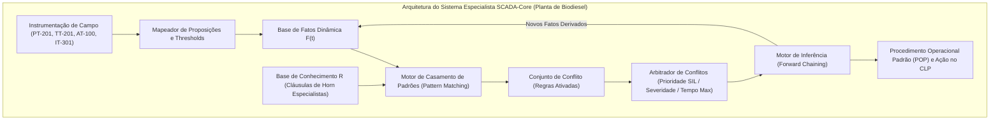

# Aula 08: Sistemas Especialistas — Base de Conhecimento e Regras de Diagnóstico
**Projeto:** Automação e Supervisão da Planta de Produção de Biodiesel (Transesterificação em Batelada)  
**Módulo:** Sistemas Especialistas Baseados em Regras (RBS), Cláusulas de Horn e Diagnóstico de Causa-Raiz

---

## 1. Fundamentos Matemáticos: Arquitetura de Sistemas Baseados em Regras (RBS)

Em plantas químicas de processamento contínuo e batelada, como a **Planta de Produção de Biodiesel**, a ocorrência simultânea de múltiplos alarmes operacionais e distúrbios de processo requer tomada de decisão rápida e determinística. Os **Sistemas Especialistas Baseados em Regras** (*Rule-Based Expert Systems - RBS*) provêm uma infraestrutura formal para diagnóstico automatizado de causa-raiz e orientação operacional em tempo real.

### 1.1. Formalização Matemática da Tripla de Inferência

Formalmente, um Sistema Especialista Baseado em Regras é modelado pela tripla:

$$\langle \mathcal{F}, \mathcal{R}, \mathcal{E} \rangle$$

Onde:

1. **$\mathcal{F}$ (Base de Fatos Dinâmica):** Conjunto finito de proposições atômicas e predicados booleanos que representam o estado físico-operacional instantâneo da planta no instante $t$:
   $$\mathcal{F}(t) = \{f_1, f_2, \dots, f_m\} \subseteq \mathcal{U}_{\text{fatos}}$$
   Cada fato $f_i$ pode ter origem direta em telemetria de sensores discretos/transmissores (`FONTE = "SENSOR"`) ou ter sido derivado por passos anteriores de inferência (`FONTE = "INFERIDO"`).

2. **$\mathcal{R}$ (Base de Conhecimento / Regras de Produção):** Conjunto finito de regras especializadas expressas formalmente como **Cláusulas de Horn Definidas**:
   $$R_i: \quad \text{SE } \left( \bigwedge_{j=1}^{k} A_{i,j} \right) \quad \text{ENTÃO } \quad C_i$$
   Na álgebra proposicional clássica, cada Cláusula de Horn possui no máximo um literal positivo (o consequente $C_i$):
   $$R_i \equiv \left( \bigvee_{j=1}^{k} \neg A_{i,j} \right) \lor C_i$$

3. **$\mathcal{E}$ (Estratégia de Resolução de Conflitos e Execução):** Mecanismo determinístico de arbitragem para ordenar a agenda de regras ativadas simultaneamente (*Conflict Set*), priorizando a segurança de vidas humanas, integridade de vasos de pressão e proteção ambiental conforme os níveis SIL (IEC 61508 / IEC 61511).

---

## 2. Catálogo Especialista de Regras de Diagnóstico da Planta de Biodiesel

A base de conhecimento cobre as anomalias e contingências operacionais mais críticas nos Setores 100, 200, 300 e 400 da planta:

| ID Regra | Antecedentes ($\bigwedge A_i$) | Consequente ($C_i$) | Diagnóstico de Causa-Raiz | Severidade / Prioridade | $t_{\text{max}}$ | POP Associado |
| :--- | :--- | :--- | :--- | :---: | :---: | :--- |
| **R-01** | $p_1 \land t_{\text{alta}}$ | <code>EXOTERMIA_RUNAWAY_REATOR</code> | **Exotermia Descontrolada e Sobrepressão no Reator R-200** | **CRÍTICA** (Prio: 10) | $0.5\text{ s}$ | **POP-SIS-01:** Desarme total de <code>HT-201</code>, corte de <code>XV-202</code> e abertura plena de <code>CW-201</code> |
| **R-02** | <code>EXOTERMIA_RUNAWAY</code> $\land$ <i>v</i>in_mix | <code>TRIP_ALIMENTACAO_METOXIDO</code> | **Corte Imediato da Dosagem de Metóxido por Reação Fora de Controle** | **CRÍTICA** (Prio: 10) | $0.5\text{ s}$ | **POP-SIS-02:** Fechar imediatamente <code>XV-202</code>, desenergizar <code>P-102</code> e inertizar com $\text{N}_2$ |
| **R-03** | $g_{\text{alm}}$ | <code>VAZAMENTO_GAS_METANOL_S100</code> | **Detecção de Vapores Inflamáveis/Tóxicos de Metanol no Setor 100** | **CRÍTICA** (Prio: 9) | $1.0\text{ s}$ | **POP-SST-03:** Cortar <code>XV-102</code> e <code>XV-202</code>, ligar exaustão e desenergizar bombas <code>P-102</code> |
| **R-04** | $l_{\text{alto}} \land$ <i>v</i>in_oleo | <code>TRANSBORDAMENTO_REATOR_R200</code> | **Sobrecarga Volumétrica de Óleo Vegetal no Reator de Transesterificação** | **CRÍTICA** (Prio: 9) | $1.0\text{ s}$ | **POP-PR-01:** Fechar <code>XV-201</code>, desligar bomba de óleo <code>P-101</code> e reter batelada |
| **R-05** | $h_1 \land \neg r_1$ | <code>OPERACAO_TERMICA_SEM_SALVAGUARDA</code> | **Acionamento de Aquecedor HT-201 sem Resfriamento de Emergência** | **CRÍTICA** (Prio: 9) | $1.0\text{ s}$ | **POP-SIS-04:** Trip imediato de <code>HT-201</code> e alarme de manutenção na linha <code>CW-201</code> |
| **R-06** | $l_{\text{baixo}} \land m_{\text{reator}}$ | <code>RISCO_CAVITACAO_AGITADOR_R200</code> | **Operação do Agitador sem Carga Hidráulica Mínima no Reator R-200** | **ALTA** (Prio: 8) | $2.0\text{ s}$ | **POP-MA-05:** Desarmar inversor de <code>AG-201</code> e bloquear aquecimento <code>HT-201</code> |
| **R-07** | $v_{\text{glic}} \land \neg i_{\text{glic}}$ | <code>PERDA_BIODIESEL_DRENO_GLICERINA</code> | **Drenagem Indevida de Biodiesel Bruto pela Linha de Glicerina** | **ALTA** (Prio: 8) | $1.5\text{ s}$ | **POP-SEP-02:** Fechar válvula <code>XV-301</code> e reajustar tempo de decantação |
| **R-08** | $b_{\text{final}} \land \neg f_{\text{lav}}$ | <code>IMPUREZA_CATALISADOR_BIODIESEL</code> | **Transferência de Biodiesel sem Etapa de Lavagem Concluída** | **ALTA** (Prio: 7) | $3.0\text{ s}$ | **POP-PUR-04:** Bloquear bomba <code>P-401</code>, fechar <code>XV-401</code> e restabelecer água |
## 3. Resolução de Conflitos, Consistência e Integridade da Base

Uma Base de Conhecimento de nível industrial deve obedecer a critérios rigorosos de **integridade semântica**:

1. **Consistência Lógica:** Não podem coexistir regras com o mesmo conjunto de antecedentes que infiram conclusões contraditórias ($A \rightarrow C$ e $A \rightarrow \neg C$).
2. **Priorização por Severidade e Tempo Máximo de Resposta:** Quando múltiplos antecedentes são satisfeitos simultaneamente, as ações de segurança funcional de grau SIL 3 / Risco Crítico de Vida (Prioridade 10, $t_{\text{max}} \le 0.5\text{ s}$) são despachadas prioritariamente em relação a desvios operacionais ou perdas econômicas (Prioridades 7 e 8).
3. **Indexação por Antecedentes:** Para garantir complexidade temporal sublinear e tempo de varredura (*scan time*) determinístico no SCADA, as regras são indexadas em uma tabela hash por cada literal de entrada ($A_{i,j}$).

---

## 4. Encadeamento Progressivo (*Forward Chaining*) e Inferência Multinível

O sistema especialista opera por **Encadeamento Progressivo (*Forward Chaining*)**: a ativação de fatos primários disparada por sensores de campo infere fatos intermediários de diagnóstico, os quais realimentam a Base de Fatos $\mathcal{F}(t)$ e ativam salvaguardas de maior nível.

### Exemplo de Encadeamento no Reator R-200:
* **Passo 1 (Leitura de Sensores):** Os sensores registram sobrepressão ($p_1 = 1$) e temperatura crítica ($t_{\text{alta}} = 1$).
* **Passo 2 (Disparo da Regra R-01):** Dispara o diagnóstico de causa-raiz <code>EXOTERMIA_RUNAWAY_REATOR</code> (Prioridade 10) e executa o POP-SIS-01.
* **Passo 3 (Adição de Fato Inferido):** O fato <code>EXOTERMIA_RUNAWAY_REATOR</code> é inserido em $\mathcal{F}(t)$.
* **Passo 4 (Disparo em Cascata da Regra R-02):** Se a válvula de metóxido estiver aberta (<i>v</i>in_mix = 1), a Regra R-02 é imediatamente ativada, comandando o corte de alimentação de reagente inflamável (<code>TRIP_ALIMENTACAO_METOXIDO</code>) e emitindo o POP-SIS-02.
---

## 5. Entregável da Aula 08: Módulo de Base de Conhecimento SCADA

* **Implementação Orientada a Objetos em Python:**
  1. `Fato`: Estrutura de dados para proposições com carimbo de tempo (*timestamp*), valor lógico, descrição e rastreabilidade de origem (`"SENSOR"` vs `"INFERIDO"`).
  2. `RegraDiagnostico`: Estrutura de Cláusulas de Horn com antecedentes, consequente, severidade, prioridade, tempo máximo de resposta e Procedimento Operacional Padrão (POP).
  3. `BaseConhecimentoSCADA`: Gerenciador central com motor de indexação invertida por antecedentes, rotina de verificação de consistência lógica, exportação tabular ASCII e motor de inferência em cenários reais.

---

### Referências Consultadas
1. RUSSELL, Stuart; NORVIG, Peter. **Artificial Intelligence: A Modern Approach**. 4th ed. Pearson, 2020.
2. INTERNATIONAL ELECTROTECHNICAL COMMISSION. **IEC 61511: Functional safety - Safety instrumented systems for the process industry sector**. Geneva: IEC, 2016.
3. INTERNATIONAL ELECTROTECHNICAL COMMISSION. **IEC 61508: Functional safety of electrical/electronic/programmable electronic safety-related systems**. Geneva: IEC, 2010.
4. INTERNATIONAL SOCIETY OF AUTOMATION. **ANSI/ISA-5.1-2009: Instrumentation Symbols and Identification**. Research Triangle Park: ISA, 2009.
5. GERPEN, Jon Van et al. **Biodiesel Production Technology**. National Renewable Energy Laboratory (NREL), Subcontractor Report NREL/SR-510-36244, 2004.
 
