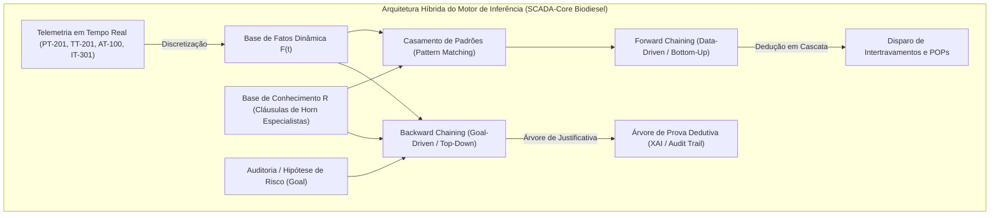

<a href="https://colab.research.google.com/github/igorfantucci/Aula-Automatica---GRUPO-5/blob/main/etapa-01-logica/09%20-%20Motor%20de%20Inferencia%20Forward%20e%20Backward%20Chaining.ipynb" target="_parent"></a>

# Aula 09: Motores de Inferência — Encadeamento para Frente e para Trás (Forward e Backward Chaining)
## Processo: Planta Industrial de Produção de Biodiesel (Transesterificação em Batelada — Grupo 5)

---

## 1. Fundamentos Matemáticos: Algoritmos de Inferência em Lógica de Produção

Um **Motor de Inferência (*Inference Engine*)** é o núcleo computacional responsável por aplicar regras formais de produção sobre uma base de fatos em constante atualização para deduzir diagnósticos de causa-raiz e comandar ações de intertravamento de segurança funcional (*Safety Instrumented Functions - SIF*).

No ecossistema do **SCADA-Core** da planta de transesterificação de biodiesel, o raciocínio dedutivo é formalizado através de duas estratégias canônicas:



### 1.1. Encadeamento para Frente (*Forward Chaining* — Data-Driven / Bottom-Up)
* **Conceito:** Parte dos **fatos conhecidos** (sensores ativados no ciclo de varredura do CLP) e dispara iterativamente todas as regras cujos antecedentes são verdadeiros (*Modus Ponens* sucessivo):
  $$\frac{\bigwedge_{j=1}^{k} A_{i,j}, \quad \left( \bigwedge_{j=1}^{k} A_{i,j} \longrightarrow C_i \right)}{C_i}$$
* **Resolução de Conflitos:** Ordenação estrita da agenda por **Prioridade de Segurança SIL** (Prioridade 10 = Risco Crítico de Vida, $t_{\text{max}} \le 0.5\text{ s}$) e **Especificidade** de antecedentes até atingir ponto fixo (*Fixed Point*).
* **Aplicação:** Detecção instantânea de *Runaway* térmico no reator $\text{R-200}$, vazamento de metanol no Setor 100 e corte imediato de reagentes inflamáveis.

### 1.2. Encadeamento para Trás (*Backward Chaining* — Goal-Driven / Top-Down)
* **Conceito:** Inicia com uma **hipótese ou meta** de diagnóstico (ex.: *"A válvula de metóxido XV-202 deve sofrer trip de corte?"*) e busca recursivamente provar as submetas necessárias.
* **Explicabilidade e Auditoria Forense (*Explainable AI - XAI*):** Constrói a **Árvore de Prova Dedutiva (*Proof Tree / Audit Trail*)**, permitindo reconstruir formalmente o caminho de falha para auditoria técnica conforme as normas IEC 61508 e IEC 61511.

---

## 2. Catálogo Especialista de Regras de Diagnóstico da Planta de Biodiesel

A base de conhecimento do Grupo 5 cobre as contingências dos quatro setores operacionais da planta:

| ID Regra | Antecedentes ($\bigwedge A_i$) | Consequente ($C_i$) | Diagnóstico de Causa-Raiz | Severidade / Prioridade | $t_{\text{max}}$ | POP Associado |
| :--- | :--- | :--- | :--- | :---: | :---: | :--- |
| **R-01** | $p_1 \land t_{\text{alta}}$ | `EXOTERMIA_RUNAWAY_REATOR` | **Exotermia Descontrolada e Sobrepressão no Reator R-200** | **CRÍTICA** (Prio: 10) | $0.5\text{ s}$ | **POP-SIS-01:** Desarme total de `HT-201`, corte de `XV-202` e abertura plena de `CW-201` |
| **R-02** | `EXOTERMIA_RUNAWAY_REATOR` $\land v_{\text{in\_mix}}$ | `TRIP_ALIMENTACAO_METOXIDO` | **Corte Imediato da Dosagem de Metóxido por Reação Fora de Controle** | **CRÍTICA** (Prio: 10) | $0.5\text{ s}$ | **POP-SIS-02:** Fechar imediatamente `XV-202`, desenergizar `P-102` e inertizar com $\text{N}_2$ |
| **R-03** | $g_{\text{alm}}$ | `VAZAMENTO_GAS_METANOL_S100` | **Detecção de Vapores Inflamáveis/Tóxicos de Metanol no Setor 100** | **CRÍTICA** (Prio: 9) | $1.0\text{ s}$ | **POP-SST-03:** Cortar `XV-102` e `XV-202`, ligar exaustão e desenergizar bombas `P-102` |
| **R-04** | $l_{\text{alto}} \land v_{\text{in\_oleo}}$ | `TRANSBORDAMENTO_REATOR_R200` | **Sobrecarga Volumétrica de Óleo Vegetal no Reator de Transesterificação** | **CRÍTICA** (Prio: 9) | $1.0\text{ s}$ | **POP-PR-01:** Fechar `XV-201`, desligar bomba de óleo `P-101` e reter batelada |
| **R-05** | $h_1 \land \neg r_1$ | `OPERACAO_TERMICA_SEM_SALVAGUARDA` | **Acionamento de Aquecedor HT-201 sem Resfriamento de Emergência** | **CRÍTICA** (Prio: 9) | $1.0\text{ s}$ | **POP-SIS-04:** Trip imediato de `HT-201` e alarme de manutenção na linha `CW-201` |
| **R-06** | $l_{\text{baixo}} \land m_{\text{reator}}$ | `RISCO_CAVITACAO_AGITADOR_R200` | **Operação do Agitador sem Carga Hidráulica Mínima no Reator R-200** | **ALTA** (Prio: 8) | $2.0\text{ s}$ | **POP-MA-05:** Desarmar inversor de `AG-201` e bloquear aquecimento `HT-201` |
| **R-07** | $v_{\text{glic}} \land \neg i_{\text{glic}}$ | `PERDA_BIODIESEL_DRENO_GLICERINA` | **Drenagem Indevida de Biodiesel Bruto pela Linha de Glicerina** | **ALTA** (Prio: 8) | $1.5\text{ s}$ | **POP-SEP-02:** Fechar válvula proporcional `XV-301` e reajustar tempo de decantação |
| **R-08** | $b_{\text{final}} \land \neg f_{\text{lav}}$ | `IMPUREZA_CATALISADOR_BIODIESEL` | **Transferência de Biodiesel sem Etapa de Lavagem Concluída** | **ALTA** (Prio: 7) | $3.0\text{ s}$ | **POP-PUR-04:** Bloquear bomba `P-401`, fechar `XV-401` e restabelecer água desmineralizada |

---

## 3. Simulação e Auditoria nos Cenários Operacionais

### 3.1. Cenário 1: Runaway Térmico no Reator R-200 (Forward Chaining)
* **Telemetria de Entrada:** $\{p_1, t_{\text{alta}}, v_{\text{in\_mix}}\}$.
* **Trilha de Disparos:**
  1. Passo 1: Disparo de **R-01** $\rightarrow$ `EXOTERMIA_RUNAWAY_REATOR` (Prioridade 10).
  2. Passo 2: Disparo de **R-02** $\rightarrow$ `TRIP_ALIMENTACAO_METOXIDO` (Prioridade 10).
* **Ação Automática:** Fechamento de emergência da válvula de metóxido $\text{XV-202}$ e desarme de $\text{HT-201}$.

### 3.2. Cenário 2: Auditoria Forense via Backward Chaining
* **Meta Investigada:** `TRIP_ALIMENTACAO_METOXIDO`.
* **Árvore de Justificativa Dedutiva:**
  ```text
  [AVALIANDO META] Investigando 'TRIP_ALIMENTACAO_METOXIDO' via 1 regra(s)...
    -> Testando Regra [R-02]: SE (EXOTERMIA_RUNAWAY_REATOR AND v_in_mix) ENTÃO TRIP_ALIMENTACAO_METOXIDO
      [AVALIANDO META] Investigando 'EXOTERMIA_RUNAWAY_REATOR' via 1 regra(s)...
        -> Testando Regra [R-01]: SE (p1 AND t_alta) ENTÃO EXOTERMIA_RUNAWAY_REATOR
          [FATO CONFIRMADO] Hipótese 'p1' presente na base de fatos.
          [FATO CONFIRMADO] Hipótese 't_alta' presente na base de fatos.
        [SUCESSO] Regra [R-01] satisfeita! Meta 'EXOTERMIA_RUNAWAY_REATOR' PROVADA com sucesso.
      [FATO CONFIRMADO] Hipótese 'v_in_mix' presente na base de fatos.
    [SUCESSO] Regra [R-02] satisfeita! Meta 'TRIP_ALIMENTACAO_METOXIDO' PROVADA com sucesso.
  ```

---

## 4. Entregável da Aula 09

* **Notebook Jupyter Pré-Executado:** [`09 - Motor de Inferencia Forward e Backward Chaining.ipynb`](file:///c:/Users/Vitória/Documents/GitHub/Aula-Automatica---GRUPO-5/etapa-01-logica/09%20-%20Motor%20de%20Inferencia%20Forward%20e%20Backward%20Chaining.ipynb) com suporte total ao Google Colab, tabelas ASCII alinhadas e bateria completa de asserções formais (`assert`).

---

### Referências Consultadas
1. RUSSELL, Stuart; NORVIG, Peter. **Artificial Intelligence: A Modern Approach**. 4th ed. Pearson, 2020.
2. INTERNATIONAL ELECTROTECHNICAL COMMISSION. **IEC 61511: Functional safety - Safety instrumented systems for the process industry sector**. Geneva: IEC, 2016.
3. INTERNATIONAL ELECTROTECHNICAL COMMISSION. **IEC 61508: Functional safety of electrical/electronic/programmable electronic safety-related systems**. Geneva: IEC, 2010.
4. INTERNATIONAL SOCIETY OF AUTOMATION. **ANSI/ISA-5.1-2009: Instrumentation Symbols and Identification**. Research Triangle Park: ISA, 2009.
5. GERPEN, Jon Van et al. **Biodiesel Production Technology**. National Renewable Energy Laboratory (NREL), Subcontractor Report NREL/SR-510-36244, 2004.
