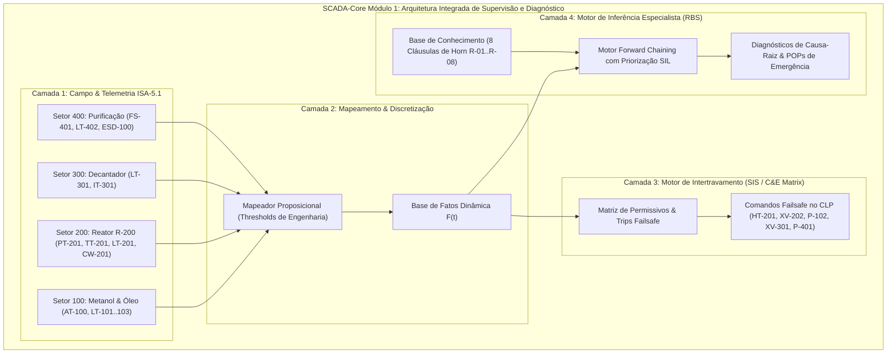

# Aula 10: Avaliação Integrada do Módulo 1 — SCADA-Core de Segurança & Diagnóstico
**Projeto:** Automação e Supervisão da Planta de Produção de Biodiesel (Transesterificação em Batelada)  
**Módulo 1:** Lógica Formal, Provas de Segurança, Matriz de Causa e Efeito e Sistemas Especialistas

---

## 1. Escopo e Diretrizes do Desafio de Engenharia

Nesta avaliação integradora, são consolidados e unificados todos os fundamentos matemáticos e computacionais desenvolvidos ao longo do **Módulo 1 (Lógica Formal & Sistemas Especialistas)**, aplicados diretamente à operação, segurança funcional e diagnóstico automatizado da **Planta Industrial de Produção de Biodiesel**.

O sistema desenvolvido constitui o **SCADA-Core Módulo 1 Integrado**, composto por cinco camadas funcionais sincronizadas:

1. **Catálogo e Telemetria ISA-5.1:** Aquisição contínua de variáveis de processo físicas (pressão, temperatura, nível, concentração de vapores, interface de fases e fluxo) com conversão de faixa de engenharia e discretização proposicional booleana;
2. **Motor de Permissivos e Intertravamentos Failsafe:** Avaliação determinística de permissivos de partida (*Start Permissives*) e desarmes de segurança (*Trips / Interlocks*) para os atuadores críticos dos Setores 100, 200, 300 e 400;
3. **Provador Dedutivo Formal de Segurança:** Prova formal de tautologias e verificação de consistência da Matriz de Causa e Efeito (ESD), garantindo ausência matemática de estados inseguros sob quaisquer contingências;
4. **Base de Conhecimento Especialista (RBS):** Modelagem de Cláusulas de Horn com 8 regras industriais de diagnóstico de causa-raiz, categorizadas por severidade, prioridade funcional SIL (IEC 61508 / IEC 61511), prazos de atuação $t_{\text{max}}$ e Procedimentos Operacionais Padrão (POP);
5. **Motor de Inferência Progressivo (*Forward Chaining*):** Raciocínio multinível e em cascata para isolamento imediato de causas-raiz e geração automática de ordens de intervenção corretiva.

---

## 2. Mapeamento de Variáveis de Processo para Proposições Lógicas (ISA-5.1)

A planta de transesterificação em batelada é monitorada pelos seguintes instrumentos e proposições booleanas:

| Setor | Tag Instrumento | Dispositivo | Variável Física / Limiar | Proposição | Descrição do Estado Lógico 1 (True) |
| :--- | :--- | :--- | :--- | :---: | :--- |
| **S-100** | `AT-100` | Detector de Gás | Vapores de Metanol $\ge 20\text{ ppm}$ | $g_{\text{alm}}$ | **ALARME:** Concentração de metanol acima do limite |
| **S-100** | `LT-101` | Chave de Nível | Óleo Vegetal $\ge 80\%$ | $l_{\text{oleo}}$ | Nível de óleo vegetal suficiente para batelada |
| **S-100** | `LT-102` | Chave de Nível | Metanol Puro $\ge 80\%$ | $l_{\text{met}}$ | Nível de metanol suficiente para batelada |
| **S-100** | `LT-103` | Transmissor Nível | Tanque de Metóxido $\ge 90\%$ | $l_{\text{mix}}$ | Volume de metóxido dosado conforme receita |
| **S-100** | `AG-103` | Motor/Contator | Misturador de Metóxido | $m_{\text{mix}}$ | Agitador do tanque de metóxido acionado |
| **S-100** | `XV-102` | Válvula de Corte | Saída de Metanol | $v_{\text{met}}$ | Válvula de bloqueio de metanol aberta |
| **S-100** | `P-102` | Motobomba | Alimentação Metanol | $b_{\text{met}}$ | Bomba de dosagem de metanol ligada |
| **S-200** | `PT-201` | Transmissor Pressão | Pressão Reator $\ge 2.5\text{ bar}$ | $p_1$ | **ALARME:** Sobrepressão no vaso do reator |
| **S-200** | `TT-201` / `TSH` | Transmissor Temp. | Temp. Reator $\ge 65^\circ\text{C}$ | $t_{\text{alta}}$ | **ALARME:** Temperatura crítica acima da faixa |
| **S-200** | `TT-201` | Transmissor Temp. | Temp. Reator $\ge 55^\circ\text{C}$ | $t_{\text{proc}}$ | Faixa ideal de transesterificação atingida |
| **S-200** | `LT-201` / `LSH` | Transmissor Nível | Nível Reator $\ge 95\%$ | $l_{\text{alto}}$ | **ALARME:** Risco de transbordamento no reator |
| **S-200** | `LT-201` / `LSL` | Transmissor Nível | Nível Reator $\le 15\%$ | $l_{\text{baixo}}$ | Nível mínimo de líquido insuficiente |
| **S-200** | `LT-201` | Transmissor Nível | Nível Reator $\ge 80\%$ | $l_{\text{reator}}$ | Nível de batelada preenchido no reator |
| **S-200** | `AG-201` | Inversor / Motor | Agitador Principal Reator | $m_{\text{reator}}$ | Agitador do reator R-200 em rotação |
| **S-200** | `HT-201` | Atuador Térmico | Jaqueta de Aquecimento | $h_1$ | Aquecedor elétrico/vapor ligado |
| **S-200** | `CW-201` | Circuito Água | Resfriamento Emergência $\ge 3\text{ bar}$ | $r_1$ | Resfriamento de emergência pressurizado |
| **S-200** | `XV-201` | Válvula On/Off | Entrada Óleo Vegetal | $v_{in\_oleo}$ | Válvula de alimentação de óleo aberta |
| **S-200** | `XV-202` | Válvula On/Off | Entrada Metóxido | $v_{in\_mix}$ | Válvula de alimentação de metóxido aberta |
| **S-300** | `LT-301` | Transmissor Nível | Decantador $\ge 90\%$ | $l_{\text{dec}}$ | Decantador com volume de repouso completo |
| **S-300** | `IT-301` | Sensor de Interface | Interface Glicerina/Biodiesel | $i_{\text{glic}}$ | Interface de separação detectada no fundo |
| **S-300** | `XV-301` | Válvula Proporcional| Dreno de Glicerina | $v_{\text{glic}}$ | Válvula de descarte de glicerina aberta |
| **S-400** | `FS-401` | Chave de Fluxo | Água de Lavagem $\ge 5\text{ L/min}$ | $f_{\text{lav}}$ | Fluxo de purificação de água presente |
| **S-400** | `LT-402` | Transmissor Nível | Tanque Biodiesel Final $\ge 95\%$ | $l_{\text{fim}}$ | **ALARME:** Tanque final de biodiesel cheio |
| **S-400** | `P-401` | Motobomba | Transferência Final | $b_{\text{final}}$ | Bomba de envio para armazenamento ligada |
| **S-400** | `XV-401` | Válvula On/Off | Entrada Tanque Final | $v_{\text{final}}$ | Válvula de recepção de produto aberta |
| **GLOBAL**| `ESD-100` | Botoeira / SIS | Parada Geral de Emergência | $e_1$ | **EMERGÊNCIA:** Botoeira acionada no painel |

---

### 3.1. Equações dos Permissivos e Desarmes (*Fail-Safe*)

1. **Aquecedor do Reator $\text{HT-201}$:**
   $$P_{\text{HT-201}} \equiv r_1 \land m_{\text{reator}} \land l_{\text{reator}} \land \neg t_{\text{alta}} \land \neg p_1 \land \neg e_1$$
   $$text{Trip}_{\text{HT-201}} \equiv \neg r_1 \lor \neg m_{\text{reator}} \lor \neg l_{\text{reator}} \lor t_{\text{alta}} \lor p_1 \lor e_1$$

2. **Válvula de Adição de Metóxido $\text{XV-202}$:**
   $$P_{\text{XV-202}} \equiv m_{\text{reator}} \land l_{\text{reator}} \land \neg p_1 \land \neg t_{\text{alta}} \land \neg l_{\text{alto}} \land \neg g_{\text{alm}} \land \neg e_1$$
   $$\text{Trip}_{\text{XV-202}} \equiv \neg m_{\text{reator}} \lor \neg l_{\text{reator}} \lor p_1 \lor t_{\text{alta}} \lor l_{\text{alto}} \lor g_{\text{alm}} \lor e_1$$

3. **Misturador de Metóxido $\text{AG-103}$:**
   $$P_{\text{AG-103}} \equiv l_{\text{mix}} \land \neg g_{\text{alm}} \land \neg e_1 \implies \text{Trip}_{\text{AG-103}} \equiv \neg l_{\text{mix}} \lor g_{\text{alm}} \lor e_1$$

4. **Dreno de Glicerina $\text{XV-301}$:**
   $$P_{\text{XV-301}} \equiv l_{\text{dec}} \land i_{\text{glic}} \land \neg e_1 \implies \text{Trip}_{\text{XV-301}} \equiv \neg l_{\text{dec}} \lor \neg i_{\text{glic}} \lor e_1$$

5. **Transferência Final $\text{P-401}$:**
   $$P_{\text{P-401}} \equiv f_{\text{lav}} \land v_{\text{final}} \land \neg l_{\text{fim}} \land \neg e_1 \implies \text{Trip}_{\text{P-401}} \equiv \neg f_{\text{lav}} \lor \neg v_{\text{final}} \lor l_{\text{fim}} \lor e_1$$

6. **Parada Total de Emergência ($\text{ESD-100}$):**
   $$e_1 \rightarrow \big(\neg h_1 \land \neg v_{\text{inmix}} \land \neg v_{\text{inoleo}} \land \neg b_{\text{met}} \land \neg v_{\text{glic}} \land \neg b_{\text{final}}\big)$$

## 4. Catálogo Oficial da Base de Conhecimento Especialista (Cláusulas de Horn)

O catálogo consolida as **8 Regras Especialistas de Diagnóstico de Causa-Raiz (R-01 a R-08)** para a Planta de Biodiesel:

| ID Regra | Antecedentes ($\bigwedge A_{i,j}$) | Consequente ($C_i$) | Diagnóstico de Causa-Raiz | Severidade / Prioridade | $t_{\text{max}}$ | Procedimento Operacional Padrão (POP) |
| :--- | :--- | :--- | :--- | :---: | :---: | :--- |
| **R-01** | $p_1 \land t_{\text{alta}}$ | `EXOTERMIA_RUNAWAY_REATOR` | **Exotermia Descontrolada e Sobrepressão no Reator R-200** | **CRÍTICA** (Prio: 10) | $0.5\text{ s}$ | **POP-SIS-01:** Desarme total de `HT-201`, corte de `XV-202` e abertura plena de `CW-201` |
| **R-02** | `EXOTERMIA_RUNAWAY_REATOR` $\land v_{\text{inmix}}$ | `TRIP_ALIMENTACAO_METOXIDO` | **Corte Imediato da Dosagem de Metóxido por Reação Fora de Controle** | **CRÍTICA** (Prio: 10) | $0.5\text{ s}$ | **POP-SIS-02:** Fechar imediatamente `XV-202`, desenergizar `P-102` e inertizar com $\text{N}_2$ |
| **R-03** | $g_{\text{alm}}$ | `VAZAMENTO_GAS_METANOL_S100` | **Detecção de Vapores Inflamáveis/Tóxicos de Metanol no Setor 100** | **CRÍTICA** (Prio: 9) | $1.0\text{ s}$ | **POP-SST-03:** Cortar `XV-102` e `XV-202`, ligar exaustão e desenergizar bombas `P-102` |
| **R-04** | $l_{\text{alto}} \land v_{\text{inoleo}}$ | `TRANSBORDAMENTO_REATOR_R200` | **Sobrecarga Volumétrica de Óleo Vegetal no Reator de Transesterificação** | **CRÍTICA** (Prio: 9) | $1.0\text{ s}$ | **POP-PR-01:** Fechar `XV-201`, desligar bomba de óleo `P-101` e reter batelada |
| **R-05** | $h_1 \land \neg r_1$ | `OPERACAO_TERMICA_SEM_SALVAGUARDA` | **Acionamento de Aquecedor HT-201 sem Circuito de Resfriamento de Emergência** | **CRÍTICA** (Prio: 9) | $1.0\text{ s}$ | **POP-SIS-04:** Trip imediato de `HT-201` e alarme de manutenção na linha `CW-201` |
| **R-06** | $l_{\text{baixo}} \land m_{\text{reator}}$ | `RISCO_CAVITACAO_AGITADOR_R200` | **Operação do Agitador sem Carga Hidráulica Mínima no Reator R-200** | **ALTA** (Prio: 8) | $2.0\text{ s}$ | **POP-MA-05:** Desarmar inversor de `AG-201` e bloquear aquecimento `HT-201` |
| **R-07** | $v_{\text{glic}} \land \neg i_{\text{glic}}$ | `PERDA_BIODIESEL_DRENO_GLICERINA` | **Drenagem Indevida de Biodiesel Bruto pela Linha de Fundo de Glicerina** | **ALTA** (Prio: 8) | $1.5\text{ s}$ | **POP-SEP-02:** Fechar válvula `XV-301` e reajustar tempo de decantação |
| **R-08** | $b_{\text{final}} \land \neg f_{\text{lav}}$ | `IMPUREZA_CATALISADOR_BIODIESEL` | **Transferência de Biodiesel sem Etapa de Lavagem Concluída** | **ALTA** (Prio: 7) | $3.0\text{ s}$ | **POP-PUR-04:** Bloquear bomba `P-401`, fechar `XV-401` e restabelecer água |

---

## 5. Bateria de Testes de Estresse Operacional (Suíte SCADA-Core)

O notebook executa a simulação determinística de 5 cenários críticos de processo:

1. **Cenário 1 — Operação Nominal Estável:** Todas as variáveis em faixas nominais. Permissivos liberados, zero alarmes e zero trips.
2. **Cenário 2 — Runaway Térmico e Sobrepressão no Reator R-200 ($p_1 = 1, t_{\text{alta}} = 1, v_{\text{inmix}} = 1$):** Ativação em cascata das Regras R-01 e R-02 pelo motor *Forward Chaining*, trip imediato de `HT-201` e `XV-202`, e despacho dos POP-SIS-01 e POP-SIS-02.
3. **Cenário 3 — Vazamento de Vapores de Metanol no Setor 100 ($g_{\text{alm}} = 1$):** Ativação de R-03, desarme de dosagem de metanol e emissão do POP-SST-03.
4. **Cenário 4 — Partida a Seco do Agitador no Reator ($l_{\text{baixo}} = 1, m_{\text{reator}} = 1$):** Ativação de R-06, desarme de `AG-201` e inibição do aquecimento `HT-201` via POP-MA-05.
5. **Cenário 5 — Drenagem sem Interface e Parada Geral de Emergência ($v_{\text{glic}} = 1, \neg i_{\text{glic}}, e_1 = 1$):** Ativação de R-07, desarme de `XV-301` e trip global failsafe em 100% dos atuadores com emissão do POP-SEP-02.

---

## 6. Entregável da Aula 10

* **`10 - Avaliacao Modulo 1 Motor de Intertravamento e Diagnostico.ipynb`:** Script executável completo e suíte de testes de estresse validando 100% dos intertravamentos, provas formais e diagnósticos da Planta de Produção de Biodiesel.

---

### Referências Consultadas
1. RUSSELL, Stuart; NORVIG, Peter. **Artificial Intelligence: A Modern Approach**. 4th ed. Pearson, 2020.
2. INTERNATIONAL ELECTROTECHNICAL COMMISSION. **IEC 61511: Functional safety - Safety instrumented systems for the process industry sector**. Geneva: IEC, 2016.
3. INTERNATIONAL ELECTROTECHNICAL COMMISSION. **IEC 61508: Functional safety of electrical/electronic/programmable electronic safety-related systems**. Geneva: IEC, 2010.
4. INTERNATIONAL SOCIETY OF AUTOMATION. **ANSI/ISA-5.1-2009: Instrumentation Symbols and Identification**. Research Triangle Park: ISA, 2009.
5. INTERNATIONAL ELECTROTECHNICAL COMMISSION. **IEC 61131-3: Programmable controllers - Part 3: Programming languages**. Geneva: IEC, 2013.
6. GERPEN, Jon Van et al. **Biodiesel Production Technology**. National Renewable Energy Laboratory (NREL), Subcontractor Report NREL/SR-510-36244, 2004.
